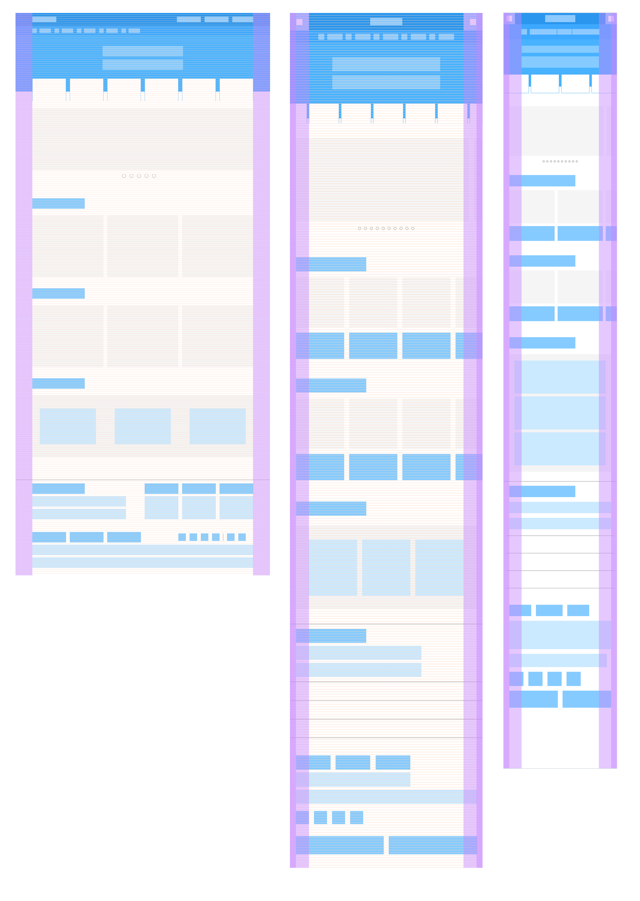

# DAY-4일차

## 1. 그리드 시스템

## 그리드 시스템 설정 공식

- 컬럼 폭 구하는 공식
    -( 최대폭(Grid) 너비 - ( 거터 폭 * ( 컬럼 수 - 1 )) / 컬럼 수 = 컬럼 폭

- 최대폭(grid) 너비 구하는 공식 */
    -( 컬럼 폭 * 컬럼 수 ) + ( 거터 폭 * (컬럼 수 - 1)) = 최대폭(Grid) 너비

- 마진(여백) 구하는 공식
    -( 중단점(breakpoint) 너비 - 최대폭(Grid) 너비 ) / 2

- 컬럼 값 픽셀 단위 퍼센트로 구하는 공식
    -( 컬럼 폭 / 최대폭(Grid) ) * 100%

## 2. 레이아웃 중단점 설정 방법

- Desktop, Tablet, Mobile 기준 중단점 (BreakPoint)을 설정
- Columns : 컬럼 수
- Gutter : 컬럼 사이 공간
- Max Width : 중단점 (변화시점)
- Margin : 레이아웃 여백

## 3. 디바이스별 그리드 시스템 설계

- Desktop
    -컬럼 (12) / 거터 (20px) / 최대 폭 (1360px) / 마진 (90px)
- Tablet
    -컬럼 (6) / 거터 (20px) / 최대 폭 (768px) / 마진(76px)
- Mobile
    -컬럼 (4) / 거터 (20px) / 최대 폭 (480px) / 마진 (24px)
